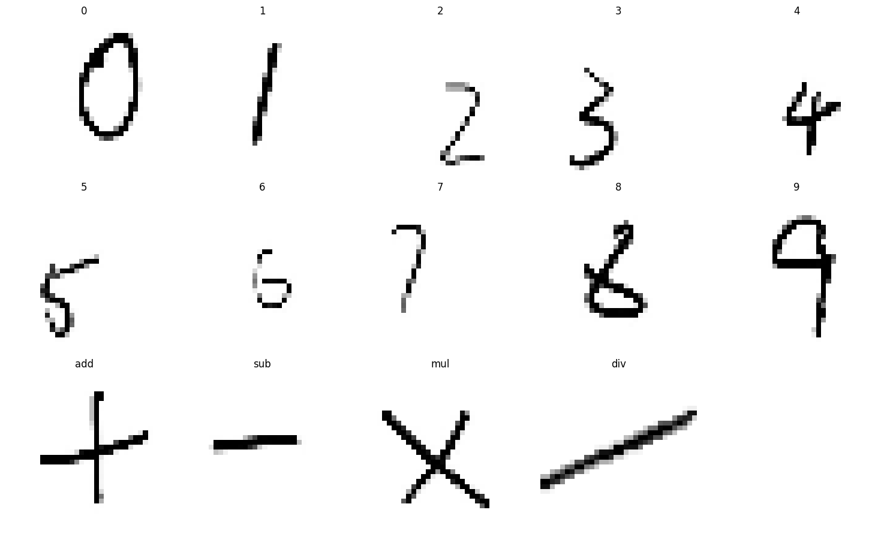
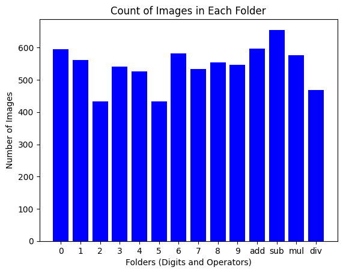
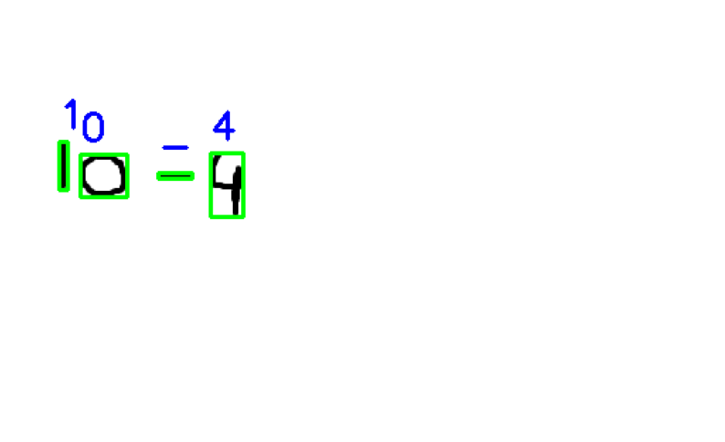
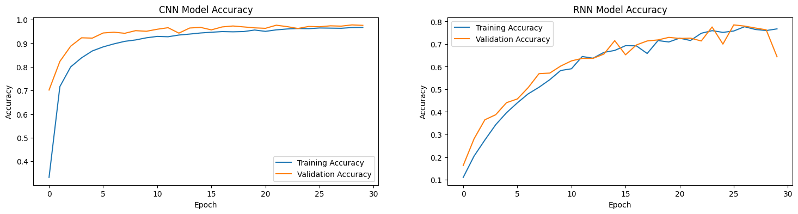

# ✍️ Handwritten Equation Solver using Deep Learning

> A deep learning pipeline using CNNs and RNNs to recognize and solve handwritten mathematical equations, with a Streamlit web app interface.

---

## 🎯 Goal

Develop a Deep Learning model that accurately recognizes and solves handwritten mathematical equations using Convolutional Neural Networks (CNNs) and Recurrent Neural Networks (RNNs).

---

## 🗂️ Dataset

The dataset used for training and testing can be accessed from:

- 📥 [Direct Download](https://cainvas-static.s3.amazonaws.com/media/user_data/Yuvnish17/data.zip)
- 📊 [Kaggle Dataset](https://www.kaggle.com/datasets/xainano/handwrittenmathsymbols/data)

---

## 🧾 Description

Traditional OCR systems often fail to handle the variability in handwriting, leading to errors in character recognition and equation interpretation. This project addresses that challenge using a deep learning approach combining spatial feature extraction (CNN) with sequential reasoning (RNN).

---

## ⚙️ What I Did

### 1. Data Preparation

The dataset contains images of handwritten mathematical symbols and equations sourced from [Kaggle](https://www.kaggle.com/datasets/xainano/handwrittenmathsymbols/data).



Preprocessing steps include resizing images, normalizing pixel values, and augmenting data to improve model robustness.



---

### 2. Character Recognition with CNN

**Model Architecture:** Multiple convolutional layers followed by pooling and fully connected layers, designed to capture spatial hierarchies and local patterns.

**Training:** The CNN was trained on individual character images and achieved a validation accuracy of **96.97%**.



CNNs are highly effective for character recognition because they learn directly from pixel values without manual feature engineering.

---

### 3. Preprocessing for Equation Recognition

Before feeding images into the model, the following steps are applied:

| Step | Description |
|------|-------------|
| 1. Grayscale conversion | Simplifies processing by removing color channels |
| 2. Thresholding | Converts image to binary format for contour detection |
| 3. Contour detection | Identifies individual symbol boundaries |
| 4. Bounding box extraction | Isolates each character into its own region |
| 5. Padding & resizing | Normalizes each character to 32×32 pixels |

---

### 4. Full Pipeline Implementation

```
Input Image → Preprocessing → CNN (Character Recognition) → RNN (Sequence Interpretation) → Solution
```

Steps:
1. **Preprocessing** — Enhance clarity and uniformity of input images
2. **Character recognition** — CNN classifies individual characters
3. **Sequence interpretation** — RNN interprets the character sequence to form an equation
4. **Output** — Displays the interpreted equation and its solution

---

### 5. Web Application

A **Streamlit** app provides a user-friendly interface where users can draw equations on a canvas. Features include stroke width adjustment, real-time updates, and a prediction button.


---

## 🚀 Models Implemented

| Model | Purpose |
|-------|---------|
| **CNN** | Character recognition — classifies individual handwritten symbols |
| **RNN** | Sequence interpretation — forms and solves the full equation |

---

## 📚 Libraries

`TensorFlow` `Streamlit` `OpenCV` `NumPy` `Pandas` `Seaborn` `Sklearn` `Matplotlib`

---

## 🛠️ Usage

### Notebook
Open `Notebook.ipynb` and run all cells to explore data analysis, preprocessing, model training, and evaluation.

### Streamlit App

```bash
pip install -r requirements.txt
streamlit run app.py
```

---

## 📈 Performance

| Model | Validation Accuracy |
|-------|-------------------|
| **CNN** | ✅ 96.97% |
| **RNN** | 🟡 74.18% |



---

## 📝 Conclusion

The CNN-based approach achieved **96.97% accuracy** by effectively capturing spatial hierarchies and local patterns in handwritten characters. The RNN contributed **74.18% accuracy** on sequence-level interpretation to form complete equations.

The CNN excels because its convolutional layers learn complex features directly from pixel values, enabling robust classification across varied handwriting styles. Together, the two models form a capable pipeline for real-world handwritten equation solving.
